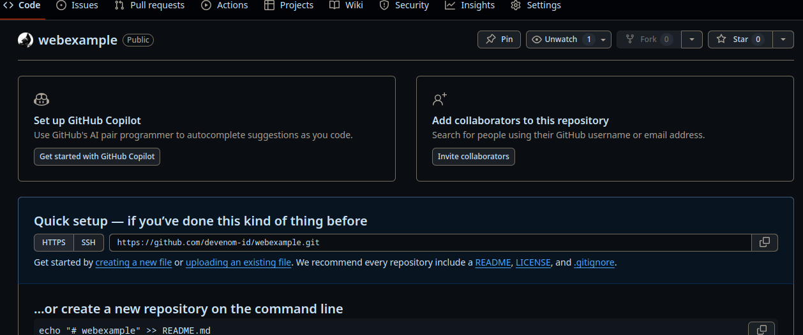
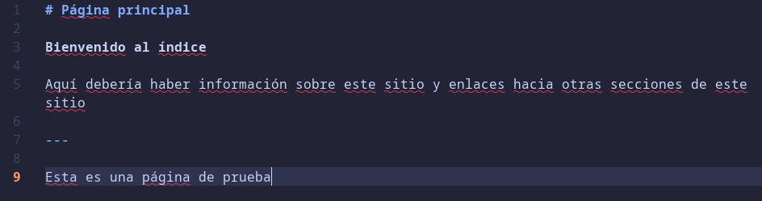
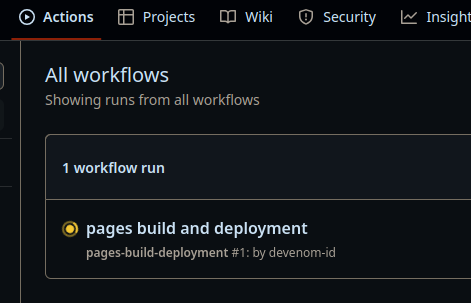

Dificultad: **Fácil**

Tiempo estimado para aprenderlo: **15 mins**

Para crear una página web aprovechando Github Pages tendremos que designar un repositorio dedicado únicamente a esto. En este repositorio guardaremos los archivos de markdown, que serán cada página de nuestro sitio, porque luego Github Pages lo convertirá en HTML y le dará estilo.

Paso 1 entonces: crear un repositorio. Para eso le damos al botón verde que dice *New* o *Nuevo* para empezar.


Ahora procede elegir el nombre del repositorio, y este es también el nombre del sitio y saldrá en el link a nuestra página. Tras elegir el nombre, el resto de los ajustes pueden quedarse tal y como se muestra en la siguiente imagen; no necesitamos ni generar un README. Terminamos y le damos al botón verde de *Create repository*.


Una vez ya creado el repositorio procedemos a copiar la dirección que nos muestra la página en la parte de *Quick setup*, y esta es la dirección a nuestro repositorio.



Tras copiarla, abrimos una sesión de terminal y ejecutamos

```
git clone [link a tu repositorio]
```


Luego de haber clonado (descargado) el repositorio en nuestro disco, ahora vamos a proseguir a entrar en él usando

```
cd [nombre del repo]
```

y luego creamos un archivo llamado index.md; esta será la página *home* de nuestro sitio. A continuación un ejemplo de prueba para continuar.



Tras guardar este archivo, en la misma sesión de terminal usamos

```
git add index.md
git commit -m "-"
git push
```


Tras haber hecho esto habrás subido el primer archivo al repositorio.

Si es la primera vez que usas git necesitarás configurar unas cosas antes de poder usar push: *tu username y tu dirección de email.*

```
git config --global user.name [tu username]
git config --global user.email [tu email]
```

Tras hacer esto, repites el comando `git push`, y esta vez funcionará. *Esta configuración sólo se realiza **una** vez y es suficiente para todos los repositorios en los que trabajes en ese dispositivo.*

Tras probar `git push` te pedirá tu username y contraseña de Github para poder hacer push al repositorio. Aún así **tu contraseña de Github no servirá** para hacer push, usar la contraseña para hacer push está obsoleto; ahora se necesita generar un token para poder hacer push.

[Clickea aquí para revisar el tutorial para generar tokens en Github](generar-token-github.html)

Ya habiendo subido el index.md queda activar Github Pages en nuestro repositorio. Para esto vamos a la configuración del repositorio y luego a la sección *Pages*.


Una vez allí, en la sección de branch tenemos que cambiar la opción *None* por la opción *main*, y luego pulsa el botón *Save* para finalmente activar Github Pages en la rama principal del repositorio.


Desde entonces, cada vez que se haga push en ese repositorio, Github volverá a usar Jekyll para convertir markdown en HTML.

La publicación de la página no se actualizará instantáneamente, puede tardar desde unos segundo hasta unos minutos dependiendo de qué tan pesada sea. Podemos revisar si ya se reflejo en la página el último push que hicimos al repositorio revisando en la pestaña de *Actions* del repositorio.



En la parte de *Workflows*, cuando una acción se muestre con un círculo de color amarillo quiere decir que está siendo procesada y la página aún no ha reflejado los cambios. Cuando la acción termine de ser procesada se mostrará un tick verde en su lugar.


