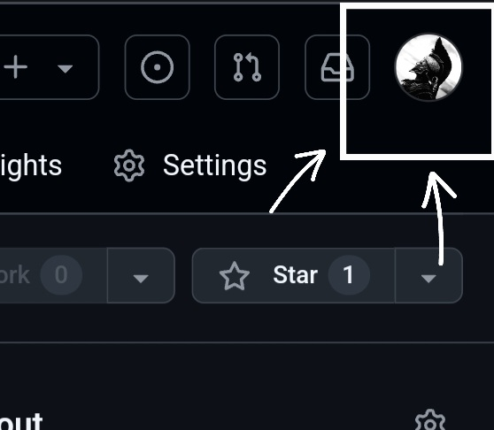
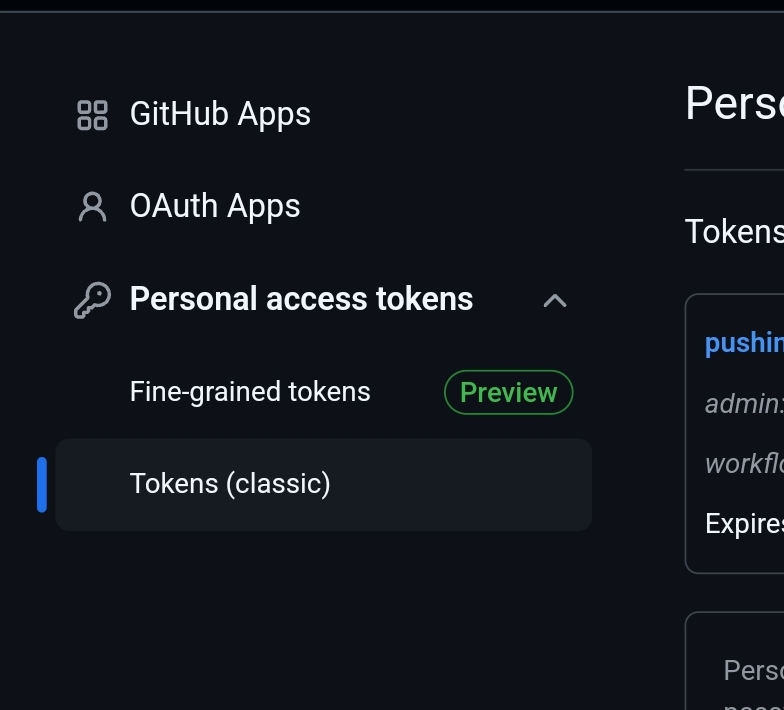
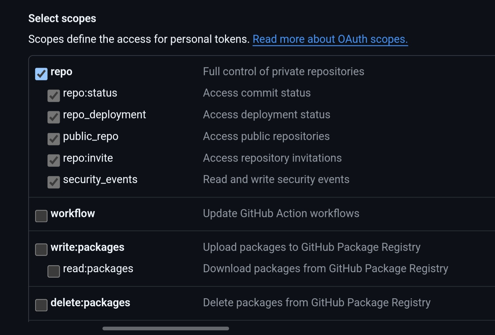
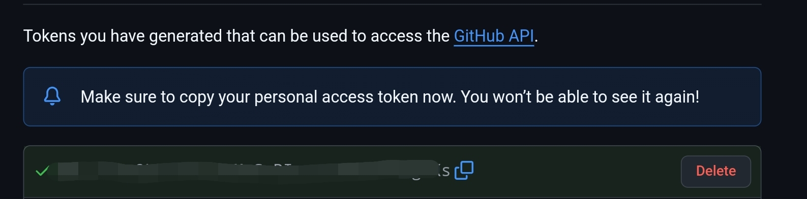

Dificultad: **Nula**

Tiempo estimado para aprenderlo: **5 mins**

---

Ya sea si queremos hacer push a un repositorio o si queremos usar Github CLI vamos a necesitar algo más que el username y la contraseña de nuestra cuenta de Github: vamos a necesitar un token.

Para generar un token, primero tenemos que ir a los ajustes de nuestro perfil. Para eso, primero clickeamos en nuestra foto de perfil, luego vamos a *Settings*

Ya en ajustes vamos a *Developer settings*, de ahí vamos a *Tokens (classic)

Pulsamos el boton *Generate new token*, y en su menú desplegable pulsamos *Generate new token (classic)*, la segunda opción.

Entonces nos llevará a otra parte donde tendremos que configurar el nuevo token. Los primeros dos campos 

