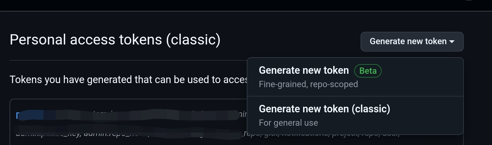

Dificultad: **Nula**

Tiempo estimado para aprenderlo: **5 mins**

---

Ya sea si queremos hacer push a un repositorio o si queremos usar Github CLI vamos a necesitar algo más que el username y la contraseña de nuestra cuenta de Github: vamos a necesitar un token.

Para generar un token, primero tenemos que ir a los ajustes de nuestro perfil. Para eso, primero clickeamos en nuestra foto de perfil, luego vamos a *Settings*

Ya en ajustes vamos a *Developer settings*, de ahí vamos a *Tokens (classic)*

Pulsamos el boton *Generate new token*, y en su menú desplegable pulsamos *Generate new token (classic)*, la segunda opción.

Entonces nos llevará a otra parte donde tendremos que configurar el nuevo token. El primer campo, **Note**, lo podemos llenar con una descripción de para qué usaremos nuestro token; podemos simplemente poner *"push"*.

El segundo campo, **Expiration** es para indicar qué tiempo de vigencia tendrá el token antes de expirar. Podemos indicar que no queremos que expire usando la opción *No expiration*. Esta opción permitirá que no tengamos que refrescar nuestro token nunca, pero no es tan segura como las demás.

Avanzando, el siguiente campo es el de **Select scopes**. Aquí indicaremos qué permisos queremos otorgarle a nuestro token. En nuestro caso, basta con marcar sólo los primeros permisos, los derivados dre **repo**, tal y como muestra la imágen.

Finalmente, clickeamos abajo de todo en el botón verde que dice *Generate token*. Esto nos enviará a otro sitio que nos dirá nuestro nuevo token. **Es importante copiarlo** porque ese token no volverá a aparecer, y si se pierde se deberá generar uno nuevo.

